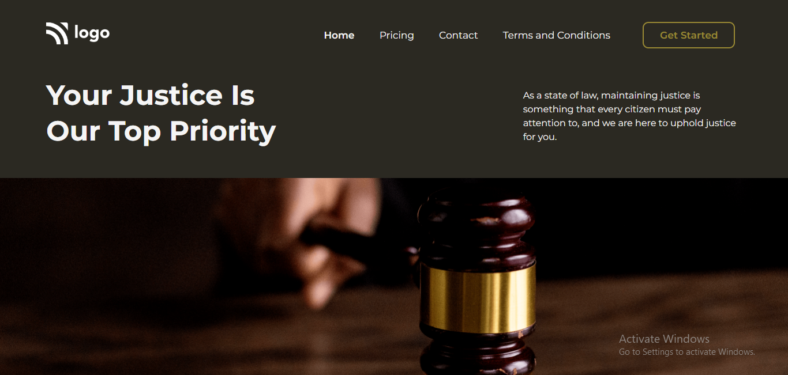

# Portfolio Project 3

## Description

This project is a home page for a law firm created using `HTML` and `CSS`.

### Learnings from this project :-

- How to create a navigation bar
- How to use CSS `display` property to arrange items in a row
- How to use `margin` and `padding` properties to provide space between elements
- How to use CSS `overflow` property

### Preview of the project :-

### [Live link](https://portfolio-project-3-beta.vercel.app/) of the project.
